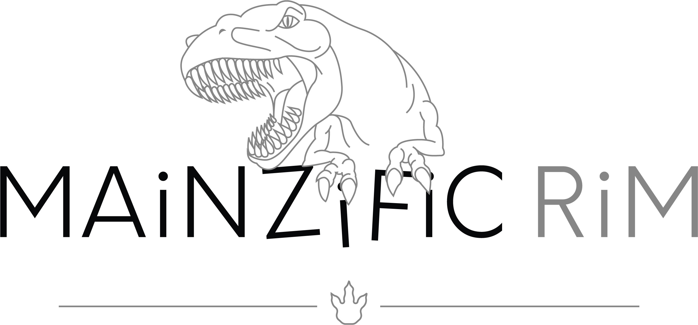
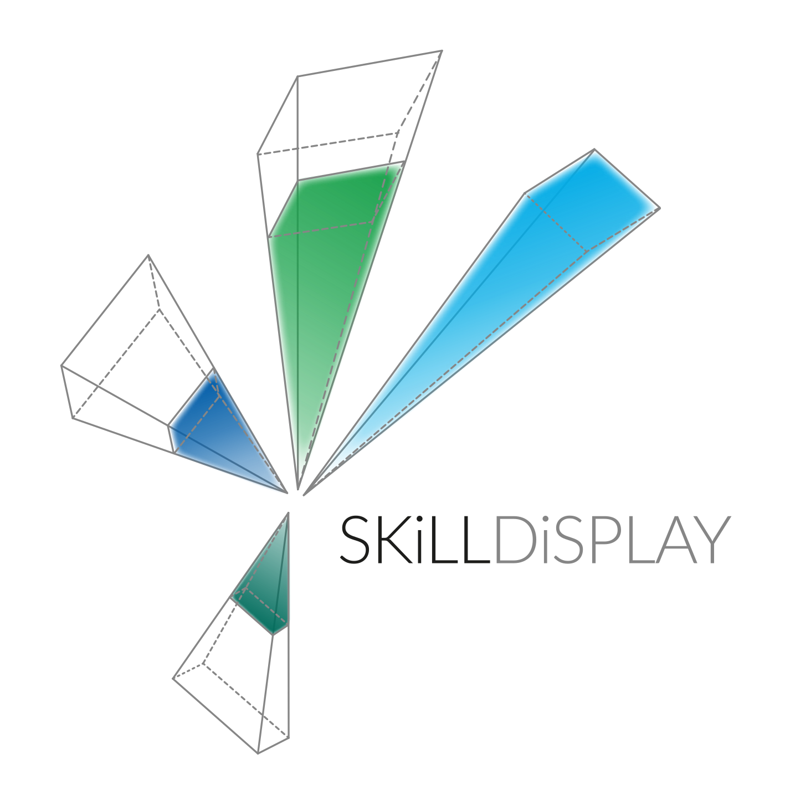

.. ==================================================
.. FOR YOUR INFORMATION
.. --------------------------------------------------
.. -*- coding: utf-8 -*- with BOM.

.. include:: Includes.txt

.. _start:

===================================
Welcome to SkillDisplay Adventure 1
===================================

Advance through the story to acquire TYPO3 CMS editor skills

It‘s about getting things done
==============================

Learning isn’t always easy, especially making the first steps. What do I need this for, where do I begin without
wasting my time?

Having a clear objective, something that is easy to grasp and achievable in a conceivable time-frame prevents
questions like that and allows to focus on the learning itself. Objective-based learning is set about giving you
a specific problem to solve and providing you with the tools necessary to acquire the knowledge to do so.

So here is your problem
=======================

Learning the skills to become a TYPO3 editor sounds good and will prove to be useful in the future. But until then
this is a rather abstract challenge, so we create a little scenario: Giant worms are about to attack the city of Mainz,
and the brave citizens of Mainz need you to inform them about their impending doom and organize their evacuation.
Split up in chapters you will face individual missions on your way to become a TYPO3 Editor and save the
day for the city of Mainz.

What is SkillDisplay
====================

SkillDisplay is a platform offering means and structure for objective-based learning. Fields of competence are
broken down into easy to grasp skills, to give learners an overview on what’s ahead of them. Arranged in optimal paths
by our technology partners each skill offers basic information on what you need to learn, gives suggestions on
where to obtain adequate learning material, and so keeps you on track to achieve your learning goal step by step.
SkillUps mark skills as acquired and can be claimed by one self (“I can do that”)
or verified by your school, employer or a certifier.

=====
Setup
=====

How to play the Skill Adventure

The adventure consists of a chain of missions
=============================================

Each mission features a title and short briefing to present you with your objective and requirements. This objective
will require the use of specific skills associated with your work as a TYPO3 Editor. After finishing a chapter,
you can claim SkillUps for skills acquired during the missions by clicking the appropriate button in the PDF
or scanning the QR code and proceed to the next chapter.
Don’t forget to claim your rewards! (check the „Rewards“ section on the SkillDisplay platform).

SkillDisplay Account
====================

You need to register on the SkillDisplay platform to unlock missions and track your SkillUps as you progress
through the adventure. You can sign up at skilldisplay_registration_.

TYPO3 Installation
==================

The Skill Adventure is built around using TYPO3 as a tool to provide information. There are two options to get
access to your TYPO3 installation:

* Ready-to-use hosted package
    You are a beginner, just want to play the adventure and have no one to help you with the setup.
    (Coming soon...)
* Site package
    You are part of an agency or school where you, a collegue, or a coach can create a setup for you.
    TYPO3 Extension Repository mainzific-rim_

Obtaining Chapter I
===================

You will receive Chapter I as reward for joining the „Mainzific Rim“ organization. Just enter your invitation code
after clicking on „My organisations“ on the SkillDisplay website.
Don‘t have an invitation code yet? Contact us on Facebook_,
Twitter_ or via E-Mail (office@skilldisplay.eu) and we‘ll send you one.
That’s it, you are ready to go and start your first mission!

.. _skilldisplay_registration: https://www.skilldisplay.eu/en/account/register/

.. _mainzific-rim: https://extensions.typo3.org/extension/mainzific_rim/
.. _Facebook: https://www.facebook.com/SkillDisplay

.. _Twitter: https://twitter.com/SkillDisplay